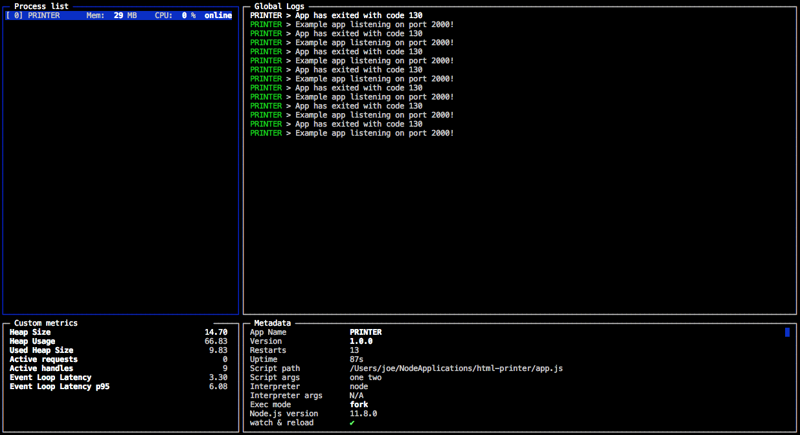
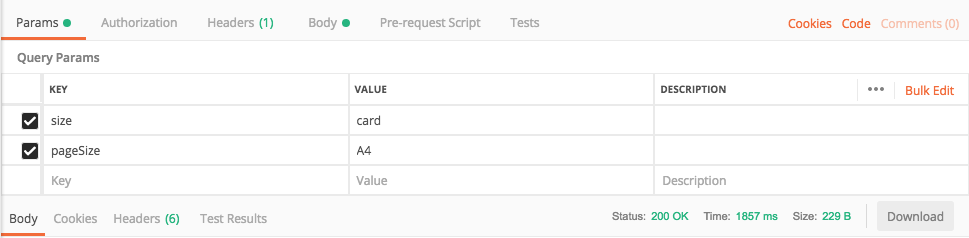
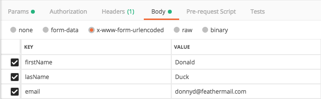
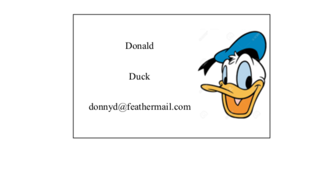

# html-printer

This project uses:

 - [pm2](https://pm2.io/doc/en//) as a process manager
 - [puppeteer](https://github.com/GoogleChrome/puppeteer) to run headless browser
 - [express](https://expressjs.com/) to expose an enpoint which interacts with puppeteer

# First Time Install

 - `git clone https://github.com/goughjo02/html-printer.git`
 - `cd html-printer`
 - `npm install`
 - `npm run build`

# Usage

 - `pm2 start` begins process manager
 - (**optional**) `pm2 monit` will show process manager output
 - GET `localhost:2000` and the print will be triggered

 # Process Manager (pm2)

Config for pm2 - `ecoststem.config.js`. 
Process entry file, `app.js`, does the following:

 - Implements a [pm2 Entrypoint](https://pm2.io/doc/en/runtime/guide/entrypoint/)
 - Launches an headless browser using [puppeteer](https://github.com/GoogleChrome/puppeteer)
 - Launches an [express app](https://expressjs.com/) to interact with puppeteer

`pm2 start` runs the process
`pm2 monit` brings up the pm2 monitor
`pm2 kill` to stop pm2 

 

 # API

 The process manager will start one browser session and hold reference to it. Each request will follow these steps:
 
  - open a new page
  - navigate to the specified url
  - directly edit some html
  - puppeteer print to pdf
  - close the page

  `localhost:2000?size=card&pageSize=a4`

**Quary Parameters** are intended for content size and print page size

 - page size options: 'A4', 'Card', 'Letter'
 - size options: 'A4', 'Card', 'Letter'

 

**urlencoded** body is for page details

`{ [key: string] : string }`

 

 # Develop Template

 What is printed is `build/index.html`. 

 For dynamically inserted data - the id of the target div must match the key in the body.

 for example this data: 

 ````js
 {
   firstname: "Donald",
   lastname: "Duck",
   email: "donnyd@feathermail.com"

 }
 ````

 would target div

 ````html
 <div id="firstname"></div>
 <div id="lastname"></div>
 <div id="email"></div>
 ````

 and convert it to 

 ````html
 <div id="firstname">Donald</div>
 <div id="lastname">Duck</div>
 <div id="email">donnyd@feathermail.com</div>
 ````

 

 This project uses webpack to transpile es6 into es5. See `webpack.config.js`.
 
 This defines `react/index.html` and `react/index.js` as inputs and `build/index.html` and `page-builder.bundle.js` as the output. `npm run dev` triggers the transpilation.

  Uncomment this line in `webpack.config.js` to enable hot-rebuild (not hot-reload).
  ````js
  {
    // watch: true,
  }
  ````

  Then you can visit the html file in the browser and design.


